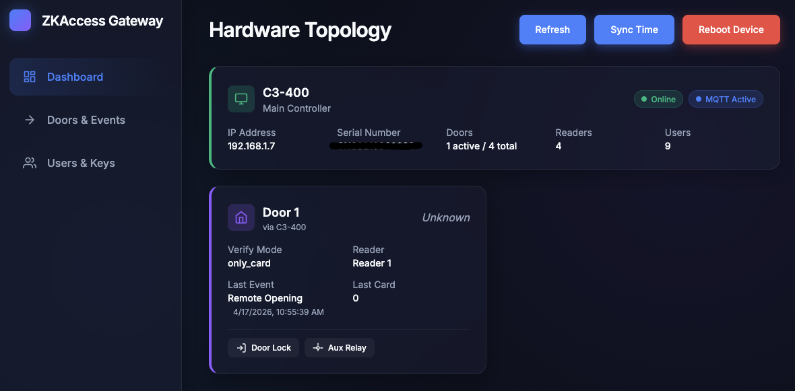
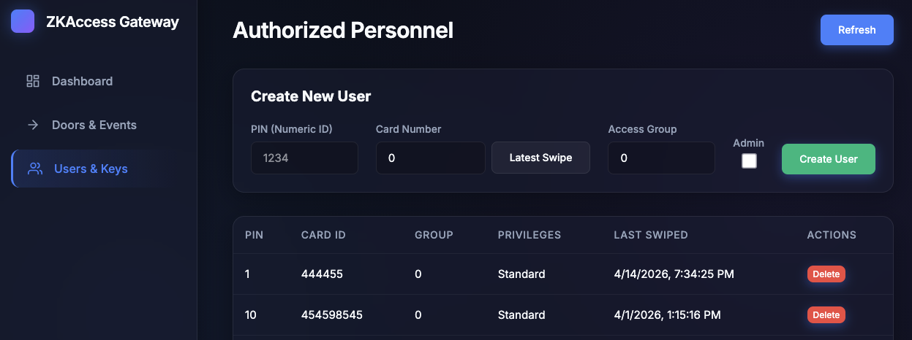
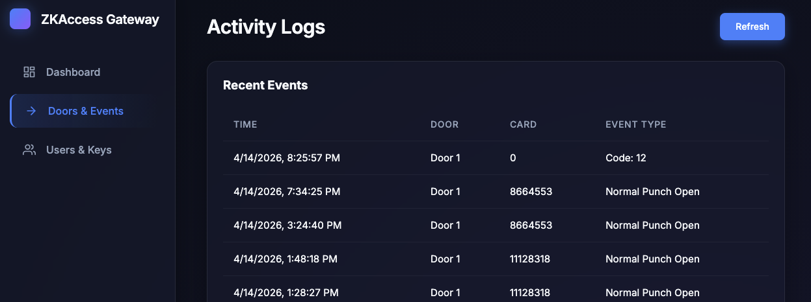

# ZKTeco Access Gateway

A Dockerized gateway designed to bridge ZKTeco C3 and C4 Access Controllers to modern integrations (like Home Assistant) over MQTT, featuring a beautiful real-time Web UI.

The Web UI is a full replacement for the ZKAccess 3.5 desktop software: live event monitoring with filters, user/card management with validity windows, per-door configuration (verify modes, lock timing, sensors, passwords), access rules (time zones, holidays, first-card, multi-card and linkage I/O tables), controller parameters (network, watchdog, daylight saving, anti-passback, interlock) and network device discovery. Every capability is declared once as a `ReadCommand`/`WriteCommand` in `backend/wine_script/zk_commands/` and automatically gains a REST endpoint and (where applicable) an MQTT command topic.

## Screenshots





## Working Principles

ZKTeco C3 and C4 devices use a proprietary Windows "PULL SDK" (`pl*.dll`). This application circumvents compatibility issues, allowing deployment straight to an ARM64 system like a Raspberry Pi:

1. **Dual-Environment Docker**: The Dockerfile builds `linux/amd64` images that run via QEMU cross-platform emulation on ARM. 
2. **Native API**: A lightning-fast Python FastAPI application manages your device state, SQLite cache, and MQTT publishing.
3. **Wine Bridge**: When the device needs to sync, the API spins up a short-lived Wine subprocess. This strictly executes the Windows PULL SDK via `pyzkaccess`, preventing Wine-related long-running memory leaks.

## How to Run

The simplest way is using Docker Compose. Ensure your Pi or server has Docker installed.

1. Create a `data/` directory adjacent to the Compose file if needed.
2. **Configuration**: Edit your `docker-compose.yml` to specify your `ZKT_CONNSTR` (e.g. `protocol=TCP,ipaddress=192.168.1.5,port=4370,timeout=4000,passwd=`) and your MQTT Broker credentials using mapping variables.
3. Build and start the infrastructure:
```bash
docker compose up --build -d
```
4. Access the Control Panel via **http://your-ip:8000** completely through your browser! You no longer need to use the settings panel inside the application GUI to map connections.

Prebuilt images are published to `ghcr.io/<owner>/zkt-access-gateway` by CI on every push to `main` (`latest`) and on `v*` tags (semver tags) as `linux/amd64` — see `.github/workflows/docker.yml`.

## How to Develop

The project enforces strict separation of concerns for development ease:

### Frontend
Situated in `/frontend`, built with standard Vite, Vanilla JS, and Tailwind CSS. 
* Run `npm install` followed by `npm run dev` to tinker entirely with the User Interface.

### Backend
Situated in `/backend`. Uses `uv` for dependency management.
* Edit `main.py` for API Endpoints.
* Edit `mqtt_manager.py` to change Home Assistant discovery payloads.
* Add a new `ReadCommand`/`WriteCommand` subclass in `/backend/wine_script/zk_commands/` to expose new functionality. The HTTP route and MQTT command topic are generated automatically from the class metadata declared there.
* Run the test suite with `uv sync && uv run pytest`, or in the exact production environment with Docker: `docker build --target test -t zkt-access-gateway:test . && docker run --rm zkt-access-gateway:test`. CI runs the Docker-suite plus the frontend build on every push/PR; the image publish workflow re-runs it as a gate before pushing.
